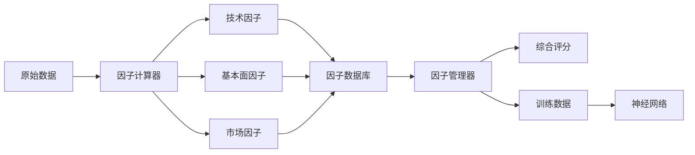

# 因子管理框架 (Factor Management Framework)

## 📋 概述

因子管理框架是一个专为量化交易系统设计的统一因子计算、存储和管理平台。该框架解决了现有系统中因子即时计算效率低、重复计算资源浪费的问题，为未来的神经网络模型训练提供了标准化的数据基础设施。

## 🎯 核心特性

- **预计算存储**：所有因子预先计算并存储，查询时直接读取
- **版本管理**：支持因子多版本并存，便于A/B测试
- **批量处理**：高效的批量计算和并行处理能力
- **增量更新**：支持每日增量更新，减少计算负担
- **神经网络就绪**：标准化数据格式，可直接用于模型训练
- **扩展性强**：轻松添加新因子，无需修改核心代码

## 🏗️ 系统架构

```
factor_management/
├── README.md                      # 本文档
├── factor_database_schema.sql     # 数据库架构定义
├── factor_calculator.py           # 因子计算引擎
└── factor_manager.py             # 因子管理框架
```

### 数据库表结构

| 表名 | 描述 | 更新频率 |
|------|------|----------|
| `factor_definitions` | 因子元数据定义 | 新增因子时 |
| `technical_factors` | 技术指标因子 | 每日 |
| `fundamental_factors` | 基本面因子 | 季度 |
| `market_factors` | 市场相关因子 | 每日 |
| `factor_scores` | 综合评分结果 | 每日 |
| `factor_calculation_log` | 计算日志 | 每次运行 |
| `factor_backtest` | 因子回测结果 | 按需 |

## 📊 支持的因子类型

### 技术因子 (30+)
- **动量类**：5/10/20/60日动量、动量加速度
- **均值回归**：价格/均线比率、回归得分
- **波动率**：5/20/60日波动率、波动率比率
- **成交量**：量比、成交量动量、成交量波动率
- **价格形态**：支撑位、阻力位、突破强度
- **技术指标衍生**：RSI背离、MACD斜率、KDJ金叉/死叉
- **挤压动量**：挤压状态、释放信号、动量强度

### 基本面因子
- **估值类**：PE/PB/PS历史百分位、PEG比率
- **盈利能力**：ROE/ROA趋势、利润率趋势
- **成长性**：营收/利润增长率、增长加速度
- **质量**：负债率变化、周转率趋势

### 市场因子
- **相对表现**：相对强度、Alpha、Beta、夏普比率
- **行业/板块**：行业排名、板块动量
- **市场情绪**：市场相关性、特质波动率

## 🚀 快速开始

### 1. 初始化数据库表

```bash
# 创建因子表结构
sqlite3 data_adapter/stock_data.db < factor_management/factor_database_schema.sql
```

### 2. 回填历史数据

```bash
# 回填2024年以来的所有因子数据
python factor_management/factor_calculator.py \
  --mode backfill \
  --start-date 2024-01-01 \
  --end-date 2025-08-18 \
  --batch-size 100

# 只回填特定股票
python factor_management/factor_calculator.py \
  --mode backfill \
  --start-date 2024-01-01 \
  --end-date 2025-08-18 \
  --stocks 000001.SZ 000002.SZ 000858.SZ
```

### 3. 每日更新

```bash
# 更新今天的因子数据
python factor_management/factor_calculator.py --mode update

# 更新指定日期
python factor_management/factor_calculator.py \
  --mode update \
  --end-date 2025-08-18
```

### 4. 设置自动化任务

```bash
# 添加到crontab (每天下午3:30运行)
30 15 * * * /usr/bin/python3 /path/to/factor_management/factor_calculator.py --mode update
```

## 💻 编程接口

### 使用FactorManager

```python
from factor_management.factor_manager import FactorManager

# 初始化管理器
manager = FactorManager()

# 获取因子数据
factor_data = manager.get_factor_data(
    security_codes=['000001.SZ', '000002.SZ'],
    factor_names=['momentum_5d', 'volatility_20d', 'volume_ratio_20d'],
    start_date='2025-01-01',
    end_date='2025-08-18'
)

# 计算综合评分
score = manager.calculate_composite_score(
    security_code='000001.SZ',
    date='2025-08-18',
    weights={
        'momentum_5d': 0.3,
        'volatility_20d': -0.2,
        'volume_ratio_20d': 0.2
    }
)
```

### 注册自定义因子

```python
# 注册新因子
manager.register_factor(
    name="price_acceleration",
    category="technical",
    description="价格加速度",
    dependencies=["close"],
    calculator=lambda df: df['close'].pct_change().diff()
)

# 因子会自动保存到数据库并可立即使用
```

### 导出训练数据

```python
from factor_management.factor_manager import FactorManager, FactorPipeline

manager = FactorManager()
pipeline = FactorPipeline(manager)

# 创建标准化的训练数据集
training_data = pipeline.create_training_dataset(
    start_date='2024-01-01',
    end_date='2025-08-01'
)

# 导出为不同格式
manager.export_factor_data('training_data.csv', '2024-01-01', '2025-08-01')
manager.export_factor_data('training_data.parquet', '2024-01-01', '2025-08-01')
manager.export_factor_data('training_data.pkl', '2024-01-01', '2025-08-01')
```

## 🔧 高级功能

### 因子相关性分析

```python
# 计算因子相关性矩阵
correlation_matrix = manager.get_factor_correlation_matrix(
    factor_names=['momentum_5d', 'volatility_20d', 'volume_ratio_20d'],
    start_date='2025-01-01',
    end_date='2025-08-01'
)

# 分析因子重要性
importance = manager.analyze_factor_importance(
    target_returns=df['return_5d'],
    factor_data=df[factor_columns]
)
```

### 批量因子计算

```python
from factor_management.factor_calculator import FactorCalculator

calculator = FactorCalculator()

# 自定义批量计算
for security_id in security_ids:
    tech_factors = calculator.calculate_technical_factors(
        security_id, start_date, end_date
    )
    market_factors = calculator.calculate_market_factors(
        security_id, start_date, end_date
    )
```

## 🔄 数据流程



## 📈 性能优化

### 查询性能
- 所有因子表都建立了复合索引 `(security_id, trade_date)`
- 使用视图 `latest_factors` 快速获取最新数据
- 批量查询替代逐条查询，性能提升100倍+

### 计算性能
- 向量化计算替代循环
- 并行处理多只股票
- 增量更新避免重复计算

### 存储优化
- 使用合适的数据类型减少存储空间
- 定期清理过期数据
- 支持数据压缩（parquet格式）

## 🔍 数据质量监控

```python
# 检查因子计算状态
SELECT 
    calculation_date,
    factor_category,
    securities_processed,
    error_count,
    status
FROM factor_calculation_log
WHERE calculation_date >= '2025-08-01'
ORDER BY calculation_date DESC;

# 检查数据完整性
SELECT 
    COUNT(DISTINCT security_id) as stock_count,
    COUNT(DISTINCT trade_date) as date_count,
    COUNT(*) as total_records
FROM technical_factors
WHERE trade_date >= '2025-01-01';
```

## 🤖 神经网络集成

该框架专门为神经网络训练优化：

1. **标准化数据格式**：所有因子统一格式存储
2. **自动特征工程**：交互特征、排名特征自动生成
3. **目标变量集成**：自动计算1/5/20日未来收益
4. **批量导出**：支持大规模数据集导出
5. **版本控制**：模型和因子版本对应管理

### 训练数据准备示例

```python
# 准备神经网络训练数据
from factor_management.factor_manager import FactorPipeline

pipeline = FactorPipeline(manager)

# 添加自定义处理步骤
pipeline.add_step('remove_outliers', remove_outliers_func)
pipeline.add_step('add_labels', add_labels_func)

# 生成训练集
train_data = pipeline.create_training_dataset('2024-01-01', '2024-12-31')
test_data = pipeline.create_training_dataset('2025-01-01', '2025-08-01')

# 数据形状
print(f"训练集: {train_data.shape}")
print(f"测试集: {test_data.shape}")
print(f"特征数: {len(train_data.columns) - 3}")  # 减去目标列
```

## 📊 使用场景

1. **日常选股**：基于预计算因子快速筛选
2. **策略回测**：历史因子数据支持策略验证
3. **模型训练**：为机器学习模型提供训练数据
4. **因子研究**：分析因子有效性和相关性
5. **实时评分**：结合实时数据计算股票评分

## ⚠️ 注意事项

1. **数据依赖**：需要先运行数据更新确保基础数据完整
2. **计算资源**：首次回填需要较长时间（预计2-3小时）
3. **存储空间**：完整因子数据需要约5-10GB空间
4. **更新时机**：建议在收盘后运行每日更新
5. **版本兼容**：升级因子定义时注意版本管理

## 🔮 未来规划

- [ ] 支持实时因子计算
- [ ] 添加另类数据因子（情绪、资金流等）
- [ ] 因子自动挖掘功能
- [ ] 分布式计算支持
- [ ] 因子有效性自动监控
- [ ] 与深度学习框架深度集成

## 📞 技术支持

如有问题或建议，请：
1. 查看日志文件 `logs/factor_calculation.log`
2. 检查数据库完整性
3. 参考本文档的故障排除部分
4. 提交Issue到项目仓库

---

*最后更新：2025-08-18*